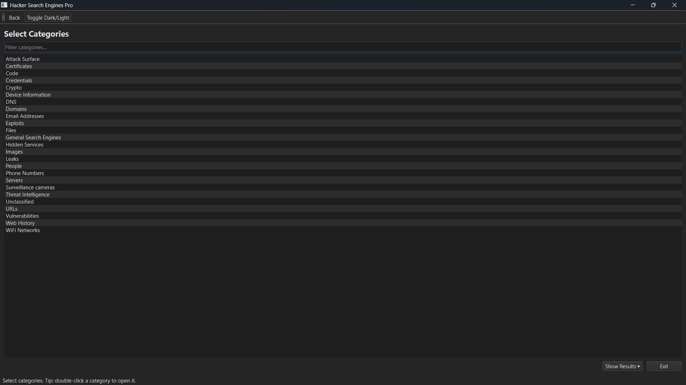
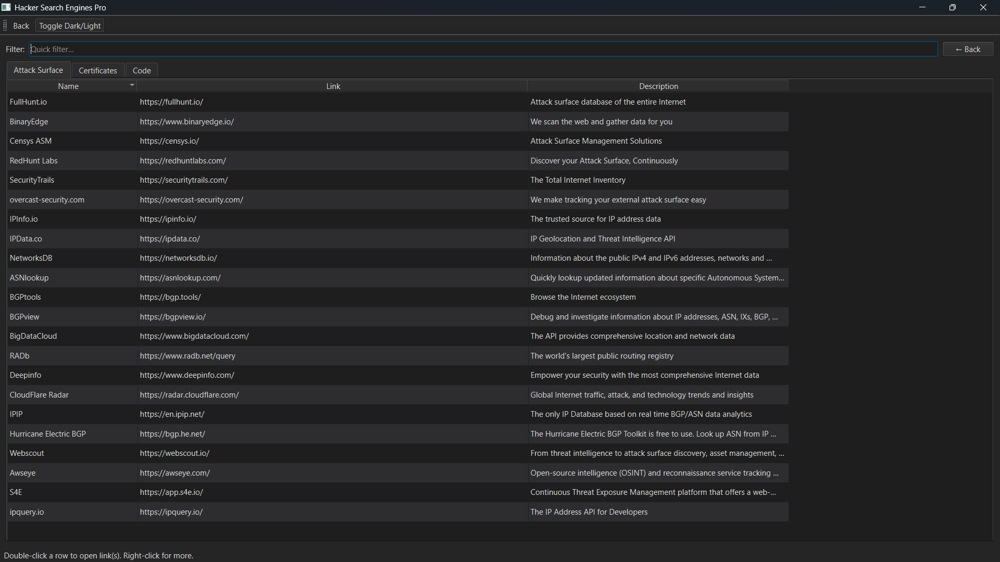

<p align="center">
  
</p>

<h1 align="center">Awesome Hacker Engines 🔍💻</h1>

<p align="center">
  <b>A modern GUI-powered toolkit to explore the world’s best hacker & OSINT search engines.</b>  
</p>

<p align="center">
  <a href="https://github.com/Harsh-Katiyar/awesome-hacker-engines/stargazers"></a>
  <a href="https://github.com/Harsh-Katiyar/awesome-hacker-engines/issues"></a>
  <a href="https://github.com/Harsh-Katiyar/awesome-hacker-engines/network/members"></a>
  <a href="LICENSE"></a>
  
</p>

---

## ✨ Overview
**Awesome Hacker Engines** is a professional-grade **GUI application** built with **PySide6/PyQt5** that lets you explore hundreds of curated **OSINT & hacker search engines**.  

It’s designed for:
- 🕵️ Penetration Testers  
- 🛡️ Red & Blue Teams  
- 🎯 Bug Bounty Hunters  
- 🔎 OSINT Researchers  
- 👩‍💻 Security Analysts  

With a **powerful category filter, instant results viewer, multi-select link actions, and dark/light themes**, this tool makes browsing specialized search engines as smooth as Google — but for the underground world.

---

## 🚀 Features
- ✅ **Category Browser**: Choose from 25+ categories (Vulnerabilities, Exploits, Threat Intel, Leaks, Domains, People, etc.)  
- ✅ **Instant Results**: Double-click a category to load search engines immediately  
- ✅ **Multi-Select Actions**: Open or copy multiple links at once  
- ✅ **Dark/Light Theme**: One-click toggle  
- ✅ **Fast Filtering**: Search inside categories or results instantly  
- ✅ **Modern UX**: Smooth scrolling, wide columns, clean Fusion theme  
- ✅ **Cross-Platform**: Runs on Linux, Windows, macOS  

---

## 📸 Screenshots
*(Add screenshots or a GIF demo here — e.g. category selection, results view, dark/light theme toggle)*  

<p align="center">
  
  <br>
  <em>Category selection with instant search.</em>
</p>

<p align="center">
  
  <br>
  <em>Results page with multi-select and context menu.</em>
</p>

---

## ⚙️ Installation

### 1️⃣ Clone the Repository
```bash
git clone https://github.com/Harsh-Katiyar/awesome-hacker-engines.git
cd awesome-hacker-engines
```

### 2️⃣ Install Dependencies
```bash
# Recommended
python3 -m venv venv
source venv/bin/activate  # (Linux/Mac)
venv\Scripts\activate     # (Windows)

# Install requirements
pip install -r requirements.txt
```

### 3️⃣ Run the App
```bash
python hacker_search_e.py
```

---

## 📂 Categories Included
- 🌐 **General Search**: Google, Bing, DuckDuckGo, SearXNG  
- 🖥️ **Servers & Attack Surface**: Shodan, Censys, FOFA, ZoomEye  
- 🛑 **Vulnerabilities**: NVD, CVE, Vulners, ExploitDB  
- 💥 **Exploits & Payloads**: Sploitus, PacketStorm, 0day.today  
- 📧 **Emails & Credentials**: Hunter.io, HaveIBeenPwned, Dehashed  
- 🔎 **Domains & DNS**: CentralOps, Whois, DNSDumpster  
- 🔐 **Leaks & Breaches**: WikiLeaks, Snusbase, Leak-Lookup  
- 🕶️ **Hidden Services**: Ahmia, OnionLand, Darkweb directories  
- 🌍 **Threat Intel**: VirusTotal, AlienVault OTX, AbuseIPDB  
- 👥 **People & Social**: Pipl, Radaris, TruePeopleSearch  
- 📷 **Images**: TinEye, Pimeyes, Karmadecay  
... and **many more!**  

---

## 🛠️ Development
- **Language:** Python 3.9+  
- **Framework:** PySide6 / PyQt5  
- **Dataset:** `search_engines_data.py` (curated OSINT search engines)  

Run with live reload during development:
```bash
python hacker_search_e.py
```

---

## 🤝 Contributing
We welcome contributions! 🚀  
- Add new search engines in `search_engines_data.py`  
- Improve GUI/UX  
- Report bugs via [Issues](https://github.com/Harsh-Katiyar/awesome-hacker-engines/issues)  

Fork, PR, and make this tool even better for the security community.  

---

## 🛤️ Roadmap
- [ ] Bookmark favorite engines  
- [ ] Export results to CSV/JSON  
- [ ] Integrate APIs (Shodan, Censys, VirusTotal)  
- [ ] Offline mode with local dataset  
- [ ] Global hotkeys & search bar  

---

## 📜 License
This project is licensed under the **MIT License** — see [LICENSE](LICENSE) for details.  

---

## 🙏 Acknowledgments
- Inspired by [awesome-hacker-search-engines](https://github.com/edoardottt/awesome-hacker-search-engines)  
- Thanks to the OSINT, Infosec & Bug Bounty community  
- Contributions & dataset expansions by amazing open-source contributors  

---

<p align="center">
⭐ If you like this project, give it a star on GitHub and share it with your network!  
</p>
